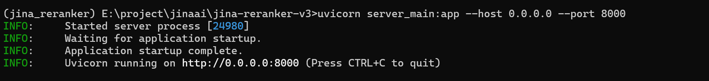

# jina-reranker-v3

# 部署流程

1. **创建 Conda 环境：**
    
    ```bash
    conda create -n jina_reranker python=3.10
    conda activate jina_reranker
    ```
    
2. **安装必要包：**
    
    ```bash
    # 安装 PyTorch (GPU版)
    conda install pytorch torchvision torchaudio pytorch-cuda=12.1 -c pytorch -c nvidia
    # 安装其他依赖
    pip install fastapi uvicorn modelscope transformers einops torch
    ```
    
3. **下载模型 ：**
    
    使用modelscope镜像下载模型到特定路径 E:\project\jina\jina-reranker-v3\model
    
    [jina-reranker-v3](https://www.modelscope.cn/models/jinaai/jina-reranker-v3)
    
    ```bash
    pip install modelscope
    modelscope download --model "jinaai/jina-reranker-v3" --local_dir "E:/project/jinaai/jina-reranker-v3/model"
    ```
    

4.**加载模型**

- **运行：** `uvicorn server_main:app --host 0.0.0.0 --port 8000`



5.验证模型


# API文档

### 1. 接口概述

- **接口描述:** Jina-reranker-v3 模型本地 API 接口，用于根据一个查询 (query)，对一个文档列表 (documents) 进行相关性重排序。
- **请求路径:** `http://127.0.0.1:8000/rerank`
- **请求方法:** `POST`

### 2. 请求 (Request)

- **请求格式:** `application/json`
- **请求参数说明:** (基于 `RerankRequest` 类)

| **参数名** | **类型** | **默认值** | **参数说明** |
| --- | --- | --- | --- |
| **`model`** | string | `"jina-reranker-v3"` | 所使用的模型名称。 |
| **`query`** | string | N/A (必需) | 用于排序的搜索查询词。 |
| **`documents`** | array (string) | N/A (必需) | 需要被重排序的字符串文档列表。 |
| **`top_n`** | integer | `None` (返回全部) | (可选) 仅返回前 N 个最相关的结果。 |
| **`return_documents`** | boolean | `False` | (可选) 是否在响应中返回原始文档文本。 |
| **`return_embeddings`** | boolean | `False` | (可选) 是否在响应中返回文档的向量 (此功能依赖于模型实现)。 |
- **请求样例:**JSON
    
    ```
     {
        "query": "What is the capital of France?",
        "documents": [
            "The sky is blue.",              # index 0
            "Paris is the capital of France.", # index 1
            "I like to eat pizza."             # index 2
        ],
        "top_n": 3,
        "return_documents": True # 请求返回原始文档，方便查看
    }
    ```
    

### 3. 响应 (Response)

- **响应格式:** `application/json`
- **响应参数说明:**

| **参数名** | **类型** | **参数说明** |
| --- | --- | --- |
| **`model`** | string | 所使用的模型名称 (e.g., "jina-reranker-v3")。 |
| **`usage`** | object | 包含 Token 数量的对象。 |
| `usage.total_tokens` | integer | 本次请求消耗的总 Token 数 (基于 tokenizer 的估算值)。 |
| **`results`** | array (object) | 包含重排序结果的列表，**已按相关性分数从高到低排序**。 |
| `results[].index` | integer | 结果在原始 `documents` 列表中的索引号。 |
| `results[].relevance_score` | number | 该文档与查询的相关性分数（浮点数，数值越大表示相关性越高）。 |
| `results[].document` | string | (可选) 原始文档的文本（仅当请求中 `return_documents=True` 时返回）。 |
| `results[].embedding` | array (number) | (可选) 文档的向量（仅当请求中 `return_embeddings=True` 且模型支持时返回）。 |
- **响应样例:**
    
    ```json
    {
      "model": "jina-reranker-v3",
      "usage": {
        "total_tokens": 0
      },
      "results": [
        {
          "index": 1,
          "relevance_score": 0.4472096860408783,
          "document": "Paris is the capital of France.",
          "embedding": null
        },
        {
          "index": 0,
          "relevance_score": -0.09588069468736649,
          "document": "The sky is blue.",
          "embedding": null
        },
        {
          "index": 2,
          "relevance_score": -0.1339346468448639,
          "document": "I like to eat pizza.",
          "embedding": null
        }
      ]
    }
    ```
